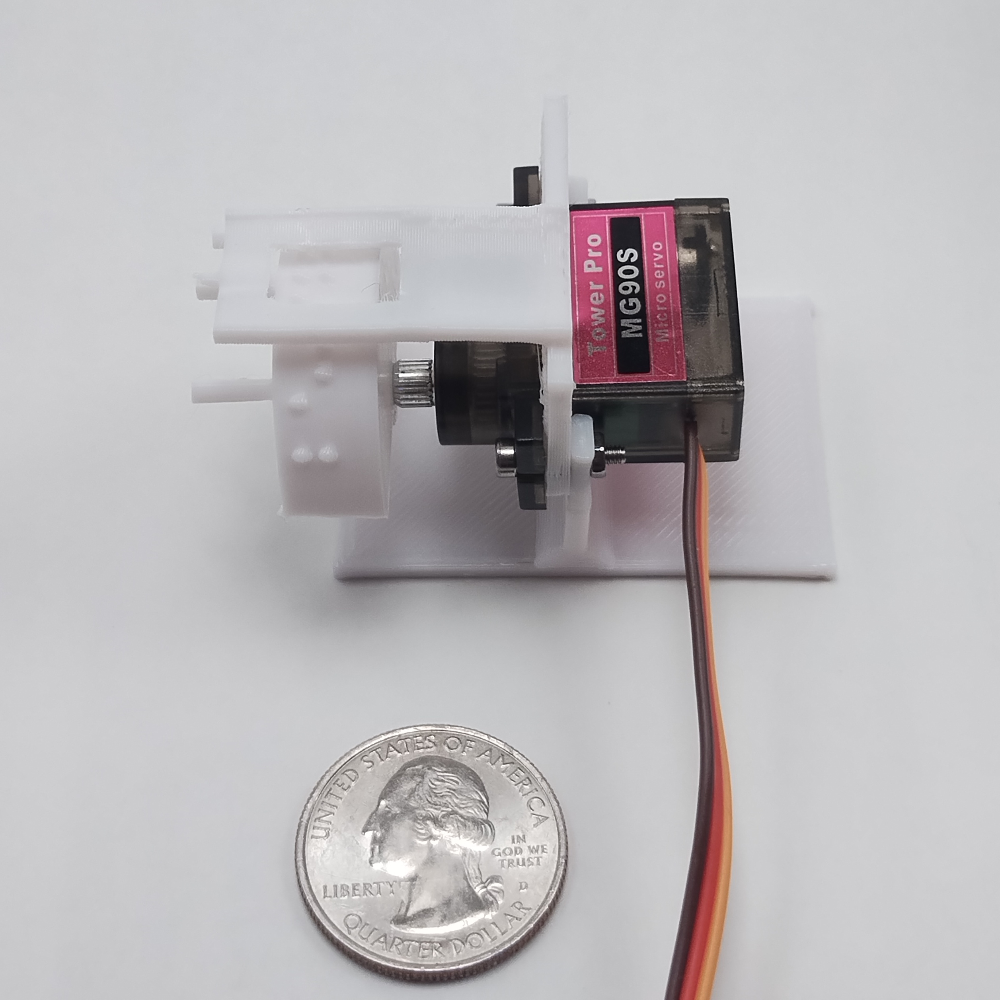
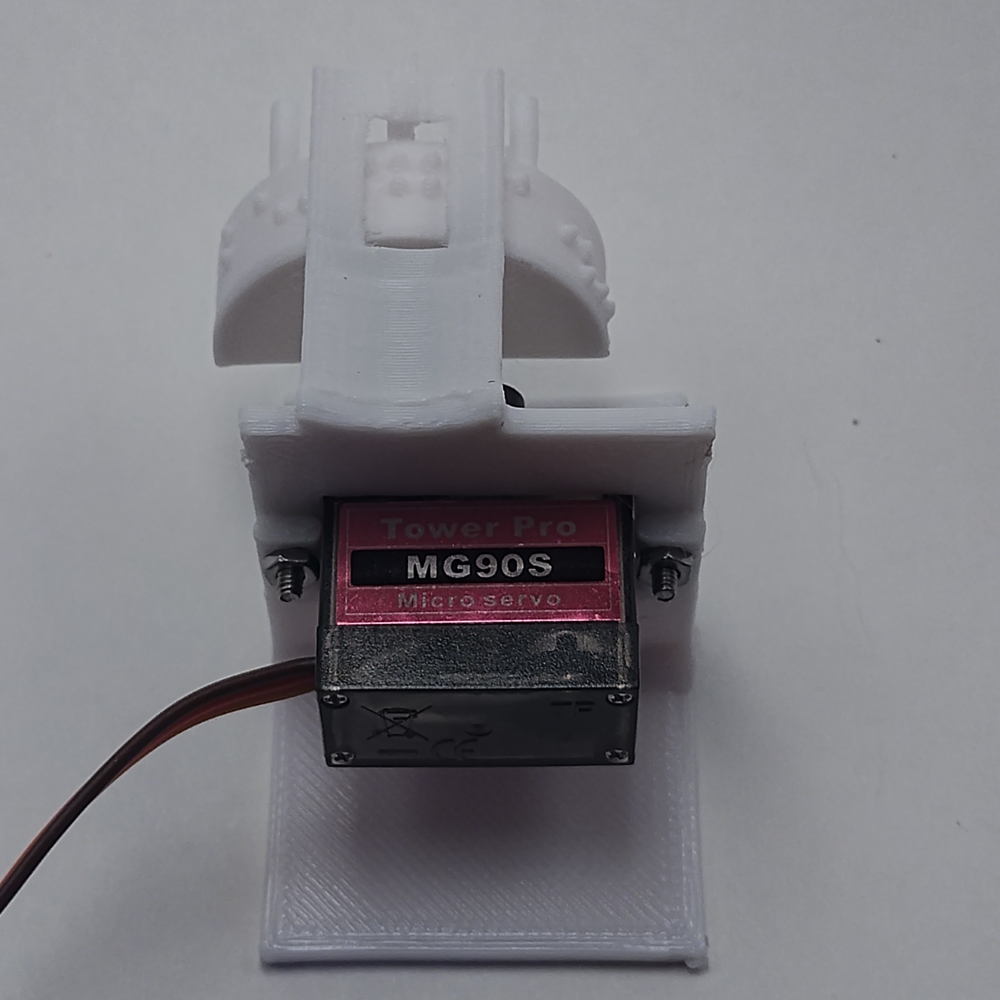

# BrailleBit - An Arduino braille display




The BrailleBit is an easy way to add a single cell of braille output to your Arduino project. It's cheap and cheerful - using only a hobby servo and 2 or 3 small 3D-printed parts. It costs less than $5, displays standard-sized braille, works with almost any microcontroller, and can be assembled and calibrated by touch. The main drawback is that it's too large to fit multiple cells side-by-side, and has a limited character set. Think of this as an alternative to a 7-segment module, not a replacement for a 2 line LCD.

The hardware is controlled with a simple Arduino library. For example, here's a sketch that repeatedly counts from 0 to 9 with a BrailleBit attached on pin 1:

```cpp
const int SERVO_PIN = ...;

// These come from servo calibration
const uint16_t US_PER_4DEG = ...;
const uint16_t US_CENTER = ...;

const uint16_t US_PER_4COL = US_PER_4DEG * NumericRotor::DEGREES_PER_DOT;
BrailleBit brailleBit(NumericRotor::CHARS);

void setup() {
    brailleBit.attach(SERVO_PIN, US_CENTER, US_PER_4COL);
}

void loop() {
    char* sequence = " 0123456789";

    for (char* ptr = message; ptr != 0; ++ptr) {
        cell.setChar(*p);
        delay(2000);
    } 
}
```


## Physical description

The BrailleBit has a small window through which you can feel two columns of braille dots. Behind this window is the rotor, which is a semicircular plastic piece that has columns of 3 dots in different combinations along its outside wall. A small servo motor allows the BrailleBit to precisely rotate the rotor to expose two adjacent columns of dots at a time. By cleverly arranging the combinations of dots on the rotor's outer wall, we make it possible to display different Braille symbols. The basic BrailleBit is designed for numeric output; it supports letters A-J (for digits 0-9 in braille), the period, minus sign, space, and colon. The result is a device that is about 3.5 cm wide, 6 cm long, and stands 4 cm high on a desk.

The minimalist design of the BrailleBit is a starting point for your own projects and designs. At its simplest, you need the 3D printed rotor and the 3D printed "cover bracket", which provides the fixed window and attaches to a common hobby servo. The base support bracket allows you to place the BrailleBit flat on a desk, with the reading window parallel to the desktop. You can also omit the base bracket and mount the BrailleBit in other ways. For example, you could cut a hole larger than the BrailleBit window in a box, then glue the cover bracket against that hole from the inside.

The provided BrailleBit rotor supports numeric output only. Specifically, it can display the numbers 0 through 9 (as A-J), the minus sign, the period, a colon (for times), and a space. Larger rotors could accommodate more letters, although the process of creating new rotors is not documented yet. A full 26 letter rotor has problems with the mechanical backlash within the servo which I am still working to overcome.

## Parts needed

Here's everything you'll need:

- 3D-printed rotor (prints/rotor.stl)
- 3D-printed cover bracket corresponding to rotor (prints/cover_bracket.stl)
- 3D-printed support bracket (prints/support_bracket.stl) (this is optional, you could mount the BrailleBit another way)
- 2x M2 screws, suggested length 10mm
- 2x m2 nut
- MG90S (or clone) micro servo
- M2.5 5mm screw for servo shaft (this should come with your servo)
- Arduino or compatible microcontroller board

Hardware stores typically don't carry very small screws like this. If you're in the US, I've found [Trimcraft Aviation](http://trimcraftaviation.com/) is a great place to buy small metric fasteners for very little money. M2 screws and nuts are extremely small so it's a good idea to have extras in case you drop one and can't find it again.

The MG90S servo was originally designed by Tower Pro; although there are now many clones available for less than $1 per piece on sites like eBay, Aliexpress, and Banggood. Usually it's more economical to buy a multi-pack. Note that you may end up with a bad batch that drifts or has other problems so consider the cost an your risk tolerance.

### If you don't have a 3D printer

3D printers are common these days at many institutions, including schools and public libraries. There may be one you can use or a service where they'll print things for you for free at these institutions. These parts can be printed on a basic filament 3D printer.

If you are Blind or an educator for Blind people, you may be able to ask the good folks at [See3D](https://see3d.org/) to print these parts for you. Be sure to send them a link to these instructions so they can read the printing notes below.

### Printing notes

Print all parts in their provided orientations.

When slicing the rotor, be sure that the Braille dots are being printed as ripples in the print's outer wall, rather than extra segments attached to the outside. I found that in Cura it was helpful to set the wall thickness to .8mm. I also found printing with thinner layers (.1mm) beneficial for the rotor. Print the rotor without supports.

For the cover bracket, you can print with relatively coarse layers. I recommend enabling supports to fill the window rather than relying on bridging, since the extra material is minimal.

For the support bracket, you don't need any support and can print fast.

## Assembly guide

1. Thread one of the M2 screws through one of the servo's mounting holes so the shaft of the screw points toward the wire end of the servo and away from the rotor.

2. Align the cover bracket with the servo. The servo's shaft is not symmetrical - it is closer to one side of the servo than the other. This is also true of the cover bracket. Slide the cover bracket around the servo and over the protruding screw so that the window in the cover is horizontally aligned with the shaft of the servo. The screw you inserted in step 1 should now pass through the servo mount and then the cover bracket. 

3. If using the base support bracket, slip it onto the screw behind the cover bracket.

4. Attach a nut to the screw and tighten, pushing the bracket(s) so they're flush with the body of the servo.

5. Add the second M2 screw and M2 nut to the other mounting hole and bracket(s) and tighten.

6. With the rotor flat on the table and the semicircular wall pointing upward, insert the servo rotor screw downward into the hole in the rotor. Lift the rotor so the screw pokes through.

7. Screw the protruding rotor screw into the servo shaft and tighten lightly. You make a final adjustment to this screw during the calibration process.

## Attaching the servo to your Arduino (or other microcontroller)

The MG90s servo requires no support circuitry to work with an Arduino. Specifically, you can connect the servo's PWM output directly to a pin on your Arduino that supports PWN, whether 3.3v or 5v. [This page](https://support.arduino.cc/hc/en-us/articles/9350537961500-Use-PWM-output-with-Arduino) lists PWM pins for official Arduino boards; for RP2040 boards like the Pi Pico all pins support PWM.

The servo needs an independent power source. I've had success powering it from the 5 volt USB supply on development boards, but to do this you'll need to account for the large spikes in current draw the servo takes when it moves. A 470 microfarad electrolytic capacitor across the power pins for the servo did the job for me, but if you're having trouble I suggest using a bench power supply at 5 or 6 volts.

### Identifying servo pins

The MG90S has a 3-pin female connector. Near the end of the connector there are 3 small notches on one side, while the other side is flat. With the notched side facing you and the connector pointing down, the pins from left to right are:

- Left (brown): Ground
- Middle (red): Power
- Right (orange): PWM input

Note if you get this backwards, the servo will not work but it also won't be damaged.

## Calibration guide

Calibrating your BrailleBit is necessary before you first use it and after you unscrew or swap the rotor. It's a quick procedure but does require a phillips head screwdriver, a connected Arduino, and 3 pushbuttons wired to I/O pins on the Arduino. Calibration will provide you with two constants `US_CENTER` and `US_PER_4DEG` that are required to control the BrailleBit.

Begin by loading the calibration sketch in the Arduino IDE (firmware/calibration/calibration.ino). You will need to update all pin assignment the constants at the top of the file (SERVO_PIN, LEFT_BUTTON_PIN, CONTINUE_BUTTON_PIN, and RIGHT_BUTTON_PIN).

Wire 3 pushbuttons between V+ and 3 different I/O pins, so that they pull the pins up when pressed. If you're using an RP2040 based board like the Pi Pico you may need external pulldown resistors since the internal ones don't seem to work. As you attach the buttons, update the Arduino sketch to note what pins they're attached to. Wire the servo PWM pin to a free PWM pin (see above) and update that constant as well. Be sure to keep track of which button is "left", "right", and "continue".
 
Upload the sketch to the board and open the serial monitor on your computer. The servo should move, and you'll get a message on the serial monitor telling you to set the center position. The calibration sketch lets you know what mode it's in on the serial console.

The rotor has three little poles sticking up from it, and there's a small tab or spike in the middle of the cover bracket above the window. The goal of the calibration procedure is to teach the Arduino how to line up these tabs.

First, mechanically center the rotor. While the sketch is holding the servo in its default position, partly unscrew the rotor. Hold the *center* tab of the rotor and turn it so it's against the tab on the cover window. Holding these together, tighten the rotor screw firmly. Do not unscrew the rotor again for the rest of the process. Do not skip the mechanical alignment step - the servo cannot rotate a full 360 degrees so we must align the rotor to its range of motion.

It's likely the alignment won't be perfect at this point, so use the left and right buttons to electronically move the rotor until the tabs are aligned as well as you can make them (the smaller window tab should be roughly centered on the rotor tab). At this point you're in coarse alignment mode and the motor will take larger steps. Pressing continue places you in the fine alignment mode where you can fine tune the alignment with smaller steps.

When you have pressed "continue" in the center coarse and fine alignment modes, the servo will swing to where it guesses the left alignment tab will be. Use the left and right buttons to align it to the left tab as well as you can in coarse mode, then press continue to enter fine mode and fine tune it.

When you press "continue" again the servo will swing into position for the final 2 alignment steps - the right coarse and fine alignment.

After you're satisfied with the alignment of the right calibration tab, press the continue button one last time. At this point the calibration sketch will start repeatedly printing values of US_CENTER and US_PER_4DEG to the serial console. Copy these values and save them - they are the goal of the calibration. If you have a problem, you can always power-cycle the Arduino and redo the calibration.

Just as a recap, here are the stages you'll go through in calibration.

1. Center coarse alignment
2. Center fine alignment
3. Left coarse alignment
4. Left fine alignment
5. Right coarse alignment
6. Right fine alignment
7. Output

### Alternatives to the serial console

If your device has no working serial console, there are 2 other ways to get the calibration constants. These can be selected by uncommenting the USE_READOUT_xxx constants in calibration.ino. If your device has EEPROM, you can uncomment USE_READOUT_EEPROM and set a value for EEPROM_WRITE_ADDRESS. The calibration routine will write in two bytes US_CENTER at that address, and US_PER_4DEG two bytes later. You can then use the [EEPROM library](https://docs.arduino.cc/learn/built-in-libraries/eeprom/) to read these values out on the same Arduino board.

Another rather inconvenient option is Morse code. Uncommenting the USE_READOUT_MORSE will cause the servo to dart left to right, sending Morse code. A short dart to the left is a dit (a Morse dot), and a longer dart to the right is a dah (Morse dash). In Morse mode the completed calibration sketch will loop endlessly, sending the morse letter C, then the digits for US_CENTER, then a D, then US_PER_4DEG. Learning morse is beyond the scope of this short tutorial.

## Controlling the BrailleBit

The BrailleBit comes with a simple control library. For now it's not in the Arduino library manager, so start your sketch by copying the code in the firmware/control folder of this repository. That code shows you how to import the BrailleBit and use it in your own projects.

The BrailleBit objects have two control commands: `displayChar()` and `setChar()`. The `setChar()` method simply moves the rotor to the specified character, and if the character hasn't changed it won't move. The `displayChar()` is a bit smarter - if the character is the same as the last one, it will jiggle the servo slightly. This provides important feedback so you can distinguished repeated characters (e.g. "1001" should look different from "101").

You can display more than one character in a couple of ways. The simples is to put a delay between each character output, which is what the example sketch does. A nicer option is to wire up a button that lets you move on to the next character, so that you can suit different users' reading speeds.

## Get in touch!
If you create something cool with the BrailleBit, or have any questions or comments, email me at troy@blindmakers.net. You can also open issues on this GitHub repository. I'd love to share and link to any other creations.
